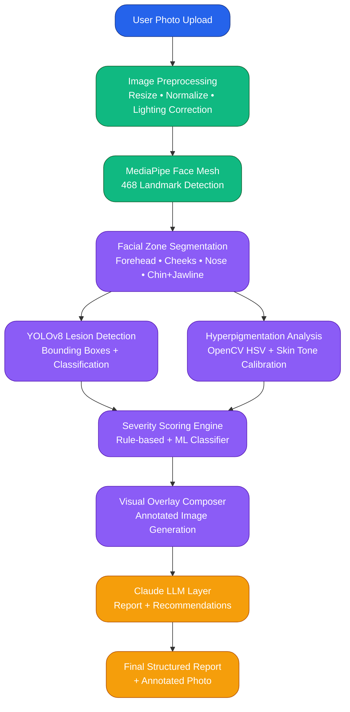

# SkinSight AI - AI Skin Health Analyzer

**Upload a selfie → Get a full dermatological-grade visual skin report in under 5 seconds.**

SkinSight AI is an intelligent web application that analyzes facial skin conditions using computer vision and AI, delivering instant, visual, and actionable insights - making professional-level skin analysis accessible to everyone.

---

## **Problem Statement**

- **3 billion people** worldwide lack access to a dermatologist.
- Dermatology consultations cost **$150–$300+** with **3–6 week** waiting times.
- **85% of skin conditions** are visually diagnosable, yet remain undetected due to access barriers.
- Existing apps lack **visual depth**, **medical-grade accuracy**, and **skin-tone inclusivity**.

**Result:** Millions suffer in silence with preventable or treatable skin issues.

---

## **Our Solution**

**SkinSight AI** bridges the gap between self-diagnosis and professional care.

**How it works:**

1. User uploads a clear facial photo
2. AI processes the image in real-time
3. Delivers a **structured, visual-first dermatological report**

### Core Outputs

- **Acne Severity Grading** (Clear → Mild → Moderate → Severe)
- **Lesion Detection** with color-coded bounding boxes
- **Facial Zone Segmentation** (Forehead, Cheeks, Nose, Chin/Jawline)
- **Hyperpigmentation Coverage** estimation with traced overlays
- **Progress Tracking** (Now / Short-term / Long-term)

---

## **Unique Selling Points (USPs)**

- **Visual-first interface** - All findings overlaid directly on the user's photo
- **Real-time inference** (< 5 seconds)
- **Non-diagnostic framing** - Medically responsible language
- **Skin-tone inclusive** - Trained across **Fitzpatrick Scale I–VI**
- **Mobile-friendly** web app

---

## **Tech Stack**

| Layer                 | Technology                                       |
| --------------------- | ------------------------------------------------ |
| **Frontend**          | React.js + TailwindCSS                           |
| **Backend**           | FastAPI (Python)                                 |
| **CV Models**         | YOLOv8 (lesion detection), MediaPipe (face mesh) |
| **Segmentation**      | SAM (Segment Anything) / DeepLabv3               |
| **Hyperpigmentation** | OpenCV HSV + Custom Skin Tone Calibration        |
| **LLM Layer**         | Claude (Anthropic) API                           |
| **Deployment**        | Docker + Render / Hugging Face Spaces            |

**Pipeline Flow:**

`Image Upload → Preprocessing → Face Mesh → Zone Segmentation → Lesion Detection → Hyperpigmentation Analysis → Severity Scoring → Visual Overlays → LLM Summary`

---

## System Architecture

### End-to-End Inference Pipeline

