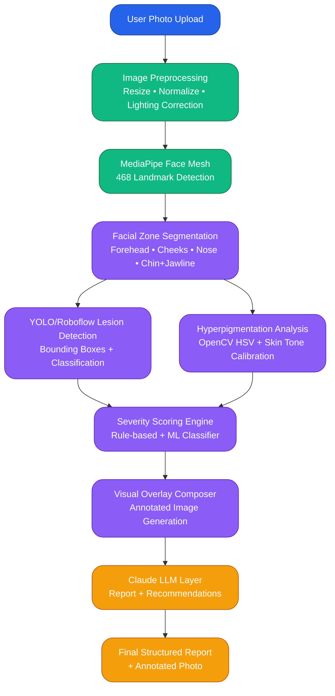

# SkinSight AI - AI Skin Health Analyzer

**Upload a selfie → Get a full dermatological-grade visual skin report in under 5 seconds.**

SkinSight AI is an intelligent web application that analyzes facial skin conditions using computer vision and AI, delivering instant, visual, and actionable insights - making professional-level skin screening accessible to everyone.

---

## **Quick Start Guide**

Follow these steps to run the project locally:

### 1. Backend Setup
```bash
cd backend
pip install -r requirements.txt
uvicorn app.main:app --reload
```

### 2. Frontend Setup
```bash
cd frontend
bun install
bun run dev
```

---

## **Problem Statement**

- **3 billion people** worldwide lack access to a dermatologist.
- Dermatology consultations cost **$150–$300+** with **3–6 week** waiting times.
- **85% of skin conditions** are visually diagnosable, yet remain undetected due to access barriers.
- Existing apps lack **visual depth**, **medical-grade accuracy**, and **skin-tone inclusivity**.

**Result:** Millions suffer in silence with preventable or treatable skin issues.

---

## **Our Solution**

**SkinSight AI** bridges the gap between self-diagnosis and professional care.

**How it works:**

1. User uploads a clear facial photo
2. AI processes the image in real-time
3. Delivers a **structured, visual-first dermatological report**

### Core Outputs

- **Acne Severity Grading** (Clear → Mild → Moderate → Severe)
- **Lesion Detection** with color-coded bounding boxes
- **Facial Zone Segmentation** (Forehead, Cheeks, Nose, Chin/Jawline)
- **Hyperpigmentation Coverage** estimation with traced overlays
- **Progress Tracking** (Now / Short-term / Long-term)

---

## **New Features**
- **History Tracking**: Keep a record of your skin analysis results.
- **Marketplace**: Browse recommended products based on your skin report.
> These features are currently available on the **`feat1`** branch.

---

## **Unique Selling Points (USPs)**

- **Visual-first interface** - All findings overlaid directly on the user's photo
- **Real-time inference** (< 5 seconds)
- **Non-diagnostic framing** - Medically responsible language
- **Skin-tone inclusive** - Trained across **Fitzpatrick Scale I–VI**
- **Mobile-friendly** web app

---

## **Tech Stack**

| Layer                 | Technology                                       |
| --------------------- | ------------------------------------------------ |
| **Frontend**          | React.js + TailwindCSS                           |
| **Backend**           | FastAPI (Python)                                 |
| **CV Models**         | YOLOv8/v11 (lesion detection), MediaPipe (face mesh) |
| **Segmentation**      | SAM (Segment Anything) / DeepLabv3               |
| **Hyperpigmentation** | OpenCV HSV + Custom Skin Tone Calibration        |
| **LLM Layer**         | Claude (Anthropic) API                           |
| **Deployment**        | Docker + Render / Hugging Face Spaces            |

---

## Core Logic & AI Models

The system employs advanced computer vision models for granular analysis:

### 1. YOLO Models Integration
SkinSight AI utilizes three specialized YOLO models:
- **`yolo11s-seg.pt`**: Primarily used for high-precision lesion segmentation to identify the exact boundaries of skin issues.
- **`yolov8s-cls.pt`**: Employed for acne severity classification, grading the overall condition into clinical levels (Clear, Mild, Moderate, Severe).
- **`yolov8m.pt`**: Serves as a robust object detection backbone for identifying various skin markers.

### 2. Roboflow & Acne Vulgaris Model
We leverage **Roboflow** for dataset management and model hosting. The **acne-vulgaris** model, trained on thousands of dermatological images, is used to detect and classify individual lesions (Comedones, Papules, Pustules, Nodules). This model is integrated into our pipeline to provide medical-grade detection accuracy.

### 3. Facial Region Detection
- **MediaPipe / Facial-region-detection**: Identifies specific parts of the face (Forehead, Nose, Chin, Cheeks) to map detected lesions to clinical regions for accurate scoring.

**Pipeline Flow:**
`Image Upload → Preprocessing → Face Mesh → Zone Segmentation → Lesion Detection (YOLO/Roboflow) → Hyperpigmentation Analysis → Severity Scoring → Visual Overlays → LLM Summary`

---

## System Architecture

### End-to-End Inference Pipeline


